# ClassicModels SQL & Python Analytics  
## Business Insights from Model Vehicle Retail Database

## Overview
This project investigates the ClassicModels database to extract actionable business insights using SQL and Python.  

It demonstrates advanced skills in data analysis, SQL querying, Python visualizations, and customer/employee performance analysis.

## Problem Statement
ClassicModels is a retail model vehicles company. Understanding customer behavior, product performance, employee productivity, and stock management is essential to optimize sales and operational efficiency.

**Research Questions:**  
- Who are the top customers and employees by revenue?  
- Which products and product lines are most profitable?  
- How do sales trends vary over time (monthly, quarterly, seasonally)?  
- How can RFM segmentation improve marketing strategies?  

---

## Data Analysis Workflow
1. Database installation and schema setup (ClassicModels)  
2. Exploratory SQL analysis (customers, products, orders, employees)  
3. Advanced SQL queries: window functions, CTEs, pivots, triggers, stored procedures  
4. Python analysis and visualization (sales trends, RFM segmentation, correlations, stock levels)  
5. Reporting and dashboard-ready outputs  

---

## Technical Stack
- MySQL (Workbench for schema and queries)  
- Python (pandas, numpy, matplotlib, seaborn, plotly)  
- Jupyter Notebooks for analysis documentation  
- PDF reporting  

---

## 1. Employee Performance & Sales

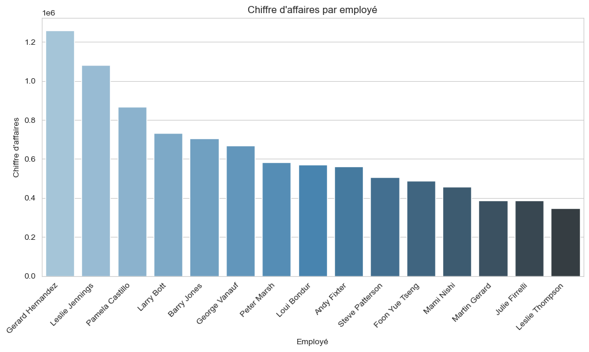
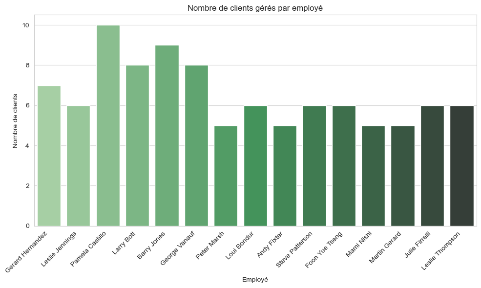
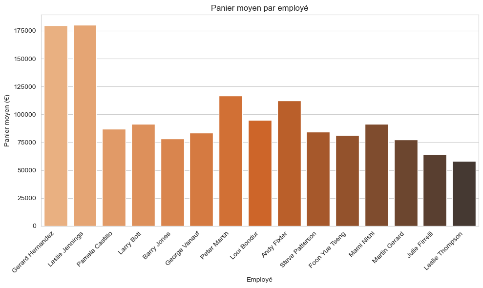

---

## 2. Customer Segmentation & Revenue Distribution

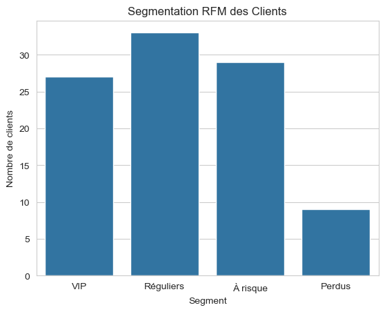
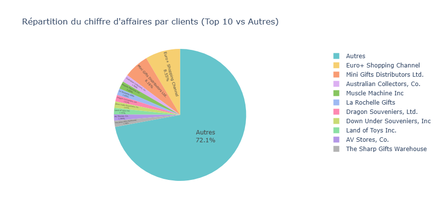
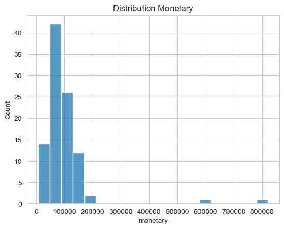
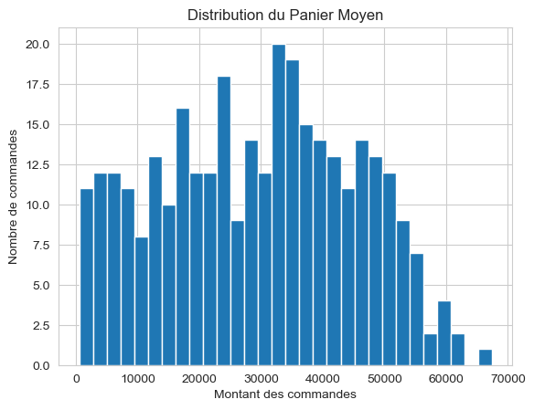

---

## 3. Product Performance & Stock Analysis

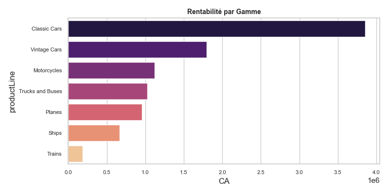
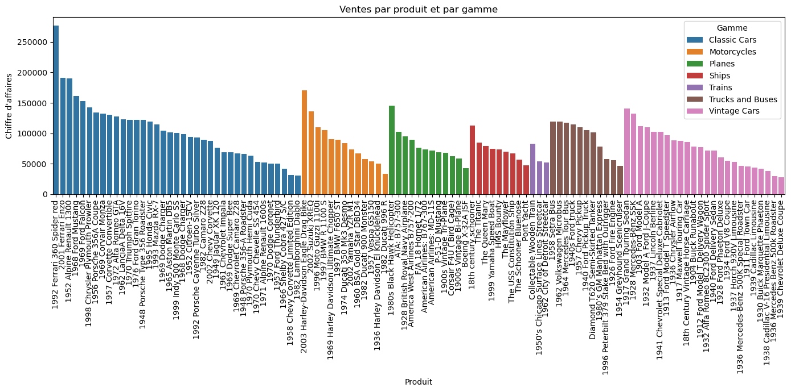

---

## 5. Geographical Analysis

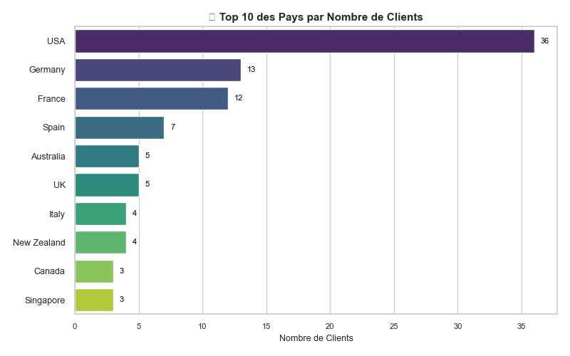
---

## 6. Stock & Order Status Insights

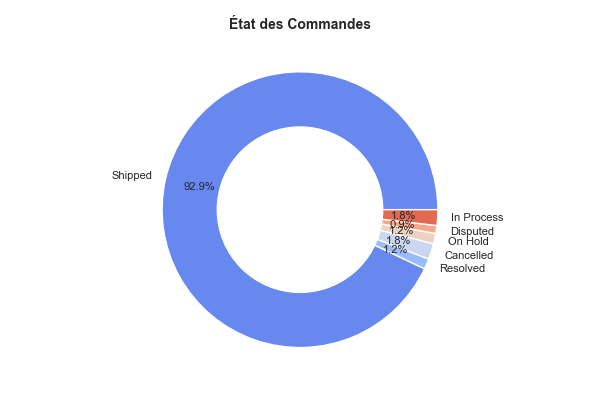
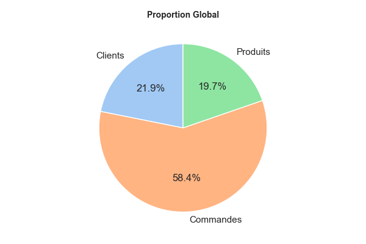

---

## How to Run the Project

1. Install MySQL and import the ClassicModels schema (`database/schema/classicmodels_schema.sql`)  
2. Run exploratory and advanced SQL queries (`database/queries/`)  
3. Install Python dependencies:

```bash
pip install -r requirements.txt
```

---

## Author  
Tasnime Hakimi  
Specialized in Data Analysis, Econometrics, and Applied Statistical Modeling
